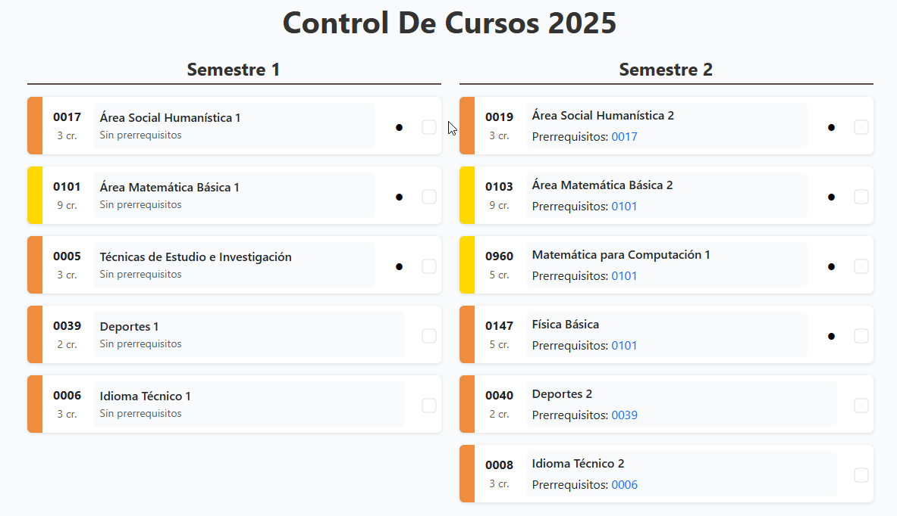
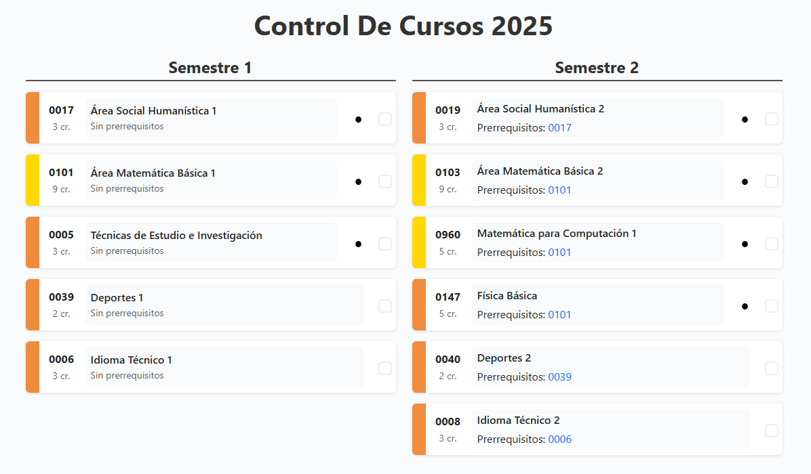
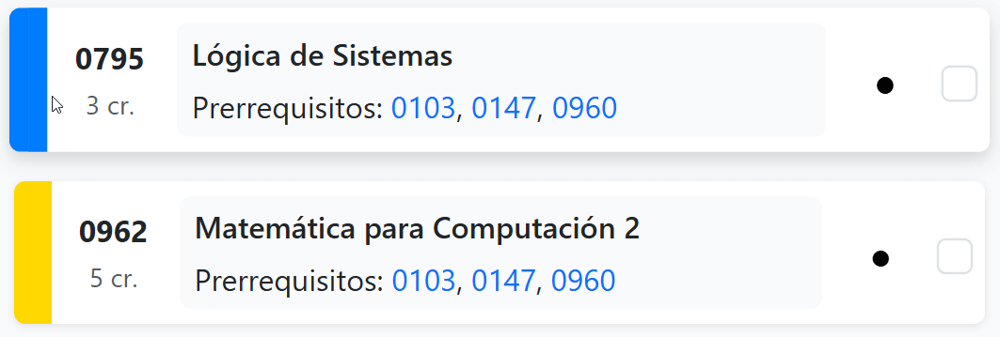
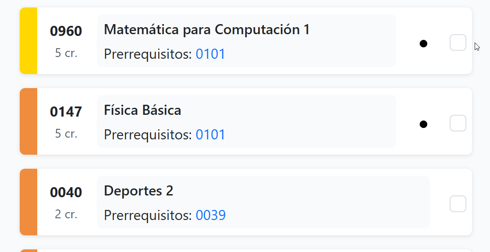
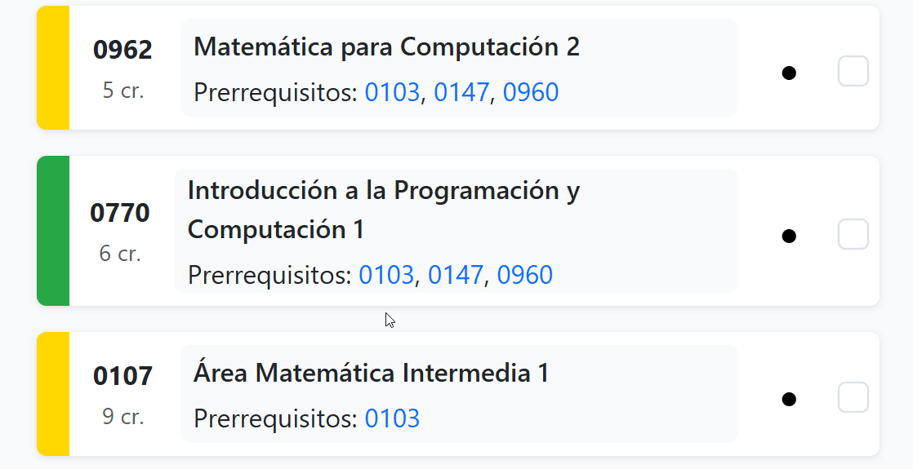
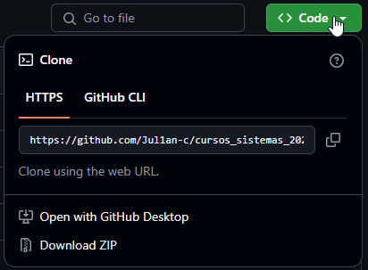

# Visualizador de Cursos - Ingeniería en Sistemas USAC

Este proyecto permite visualizar, organizar y hacer seguimiento del avance en los cursos de Ingeniería en Sistemas de la USAC pénsum 2025. Ideal para planificar, marcar cursos completados y ver los prerrequisitos de forma interactiva.



## 🚀 Funcionalidades

- Visualización semestral de cursos

- Colores por área (Desarrollo, Metodología, Ciencias.)

- Marcar cursos como completados (guardado local)

- Prerrequisitos interactivos con vista emergente


## 📦 Cómo usar

1. Clona o descarga este repositorio.

    ```bash
    git clone https://github.com/Jul1an-c/cursos_sistemas_2025.git
    ```

    

2. Abre `index.html` en tu navegador.
3. Marca los cursos que ya completaste.
4. Tu progreso se guardará automáticamente en el navegador.

> No requiere backend ni instalación.

## Tecnologías

- HTML + CSS + JavaScript
- Bootstrap 5


