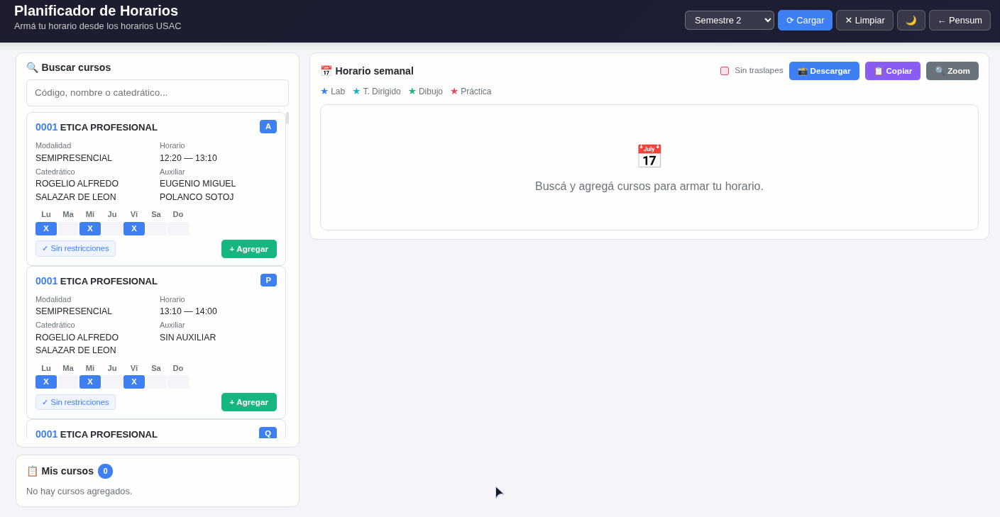

<div align="center">

# Control de Cursos — USAC

Visualizador interactivo de pensums y planificador de horarios para la **Universidad de San Carlos de Guatemala (USAC)**, desarrollado pensando en la **Facultad de Ingeniería**. Incluye inicialmente **Ingeniería en Ciencias y Sistemas (USAC CLAR 2025)** y se adapta a otras carreras de la USAC que se agreguen.

<p>
  
  
</p>

<a href="CONTRIBUTING.md">Agregar un pensum</a>

</div>

---

**Exportá seguido tu progreso** con el botón Exportar y guardá el archivo `.json` donde quieras (Drive, USB, tu PC). Después lo importás si cambiás de navegador o dispositivo.

<p align="center">
  
</p>

## Contenido

* [Usar online](#usar-online)
* [Usar localmente](#usar-localmente)
* [Funcionalidades](#funcionalidades)
* [Planificador de horarios](#planificador-de-horarios)
* [Agregar otro pensum (USAC)](#agregar-otro-pensum-usac)
* [Tecnologías](#tecnologías)

## Usar online

https://jul1an-c.github.io/control_cursos/

Abrí el link en tu PC o celular.

## Usar localmente

```bash
git clone https://github.com/Jul1an-c/control_cursos.git
cd control_cursos
```

### Pensum tracker (`index.html`)
Abrí `index.html` en tu navegador (no necesita servidor).

### Planificador de horarios (`pages/horarios.html`)
Los horarios se descargan de USAC y se guardan en `data/horarios/` como archivos estáticos (se actualizan solos cada día en GitHub). Para usarlo en local:

```bash
node server.js          # servidor local en http://localhost:3000
```

Luego abrí `http://localhost:3000`.

Para refrescar los datos de USAC manualmente:

```bash
node scripts/fetch_horarios.js
```

## Funcionalidades

| Función             | Descripción                                                       |
| ------------------- | ----------------------------------------------------------------- |
| Vista por semestre  | Cursos organizados por semestre, cada área con su color           |
| Prerrequisitos      | Cada curso muestra lo necesario. Verde si lo tenés, rojo si falta |
| Estado del curso    | "Disponible" si cumplís requisitos, "Faltan prerrequisitos" si no |
| Progreso automático | Checkbox que guarda tu avance en el navegador                     |
| Exportar / Importar | Descargá tu progreso como `.json` y restáuralo cuando quieras     |
| Tema oscuro         | Botón para cambiar entre modo claro y oscuro                      |
| Multi-pensum (USAC) | Soporta varias carreras de la USAC. Por ahora está Sistemas       |

## Planificador de horarios

Página para armar tu horario semanal a partir de los cursos publicados por la Facultad de Ingeniería de la USAC.

<p align="center">
  
</p>

* Buscá cursos por código, nombre o catedrático
* Agregalos al calendario y detectá traslapes automáticamente
* Descargá o copiá una imagen de tu horario
* Los datos se actualizan solos cada día vía GitHub Actions

> Nota: el planificador está configurado para obtener datos del sitio de horarios de **Ingeniería USAC**. Otras factultades no están soportadas.

## Agregar otro pensum (USAC)

La app soporta cualquier carrera de la **USAC**, siempre que se siga el mismo formato.

Si querés agregar Electrónica, Agronomía, un pensum anterior de Sistemas o cualquier otra carrera de la USAC, seguí la guía en [`CONTRIBUTING.md`](CONTRIBUTING.md).

## Tecnologías

<p>
  HTML5 • CSS3 • JavaScript • Bootstrap 5.3 • localStorage
</p>

---

<div align="center">

Hecho por <a href="https://github.com/Jul1an-c"><strong>Jul1an-c</strong></a>

Si este proyecto te fue útil, considerá dejar una ⭐ en el repositorio.

</div>
