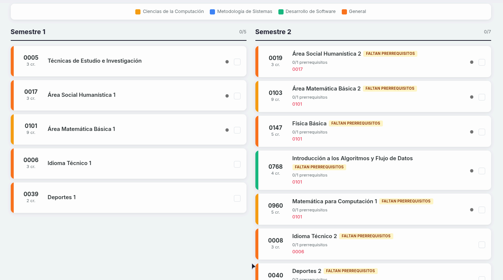

<div align="center">

# Control de Cursos — USAC

Visualizador interactivo de pensums. Incluye inicialmente **Ingeniería en Ciencias y Sistemas (USAC CLAR 2025)** y se adapta automáticamente a cualquier carrera que se agregue.

<p>
  
  
</p>

<a href="CONTRIBUTING.md">Agregar un pensum</a>

</div>

---

**Exportá seguido tu progreso** con el botón Exportar y guardá el archivo `.json` donde quieras (Drive, USB, tu PC). Después lo importás si cambiás de navegador o dispositivo.

<p align="center">
  
</p>

## Contenido

* [Usar online](#usar-online)
* [Usar localmente](#usar-localmente)
* [Funcionalidades](#funcionalidades)
* [Agregar otro pensum](#agregar-otro-pensum)
* [Tecnologías](#tecnologías)

## Usar online

https://Jul1an-c.github.io/cursos_sistemas_2025/

Abrí el link en tu PC o celular.

## Usar localmente

```bash
git clone https://github.com/Jul1an-c/cursos_sistemas_2025.git
cd cursos_sistemas_2025
```

Luego abrí `index.html` en tu navegador (no necesita servidor).

## Funcionalidades

| Función             | Descripción                                                       |
| ------------------- | ----------------------------------------------------------------- |
| Vista por semestre  | Cursos organizados por semestre, cada área con su color           |
| Prerrequisitos      | Cada curso muestra lo necesario. Verde si lo tenés, rojo si falta |
| Estado del curso    | "Disponible" si cumplís requisitos, "Faltan prerrequisitos" si no |
| Progreso automático | Checkbox que guarda tu avance en el navegador                     |
| Exportar / Importar | Descargá tu progreso como `.json` y restáuralo cuando quieras     |
| Tema oscuro         | Botón para cambiar entre modo claro y oscuro                      |
| Multi-pensum        | Soporta varias carreras. Por ahora está Sistemas USAC             |

## Agregar otro pensum

La app soporta cualquier carrera, de la USAC o de otra universidad, siempre que se siga el mismo formato.

Si querés agregar Electrónica, Agronomía, un pensum anterior de Sistemas o cualquier otra carrera, seguí la guía en [`CONTRIBUTING.md`](CONTRIBUTING.md).

## Tecnologías

<p>
  HTML5 • CSS3 • JavaScript • Bootstrap 5.3 • localStorage
</p>

---

<div align="center">

Hecho por <a href="https://github.com/Jul1an-c"><strong>Jul1an-c</strong></a>

Si este proyecto te fue útil, considerá dejar una ⭐ en el repositorio.

</div>
